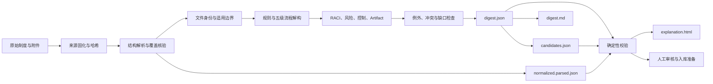

# Policy Digest：企业制度流程解构

Policy Digest 将制度、管理办法、实施细则、操作规范、授权文件及附件，转换成一套**能回到原文、能由业务人员复核、能被 Agent 使用、能投影到企业本体**的结构化成果。

它不是普通的制度摘要。摘要主要回答“文件说了什么”；Policy Digest 进一步回答：

- 这份制度适用于谁、什么场景和事项？
- 哪些句子构成强制、禁止、授权、程序、职责或豁免规则？
- 文件中包含哪些相对独立的业务流程？
- 每个流程的目标、入口、活动、输出和异常路径是什么？
- 谁执行、谁最终负责、谁需要被征询或知会？
- 流程产生或消费哪些表单、决定、数据和系统记录？
- 哪些内容是制度明文，哪些是结构推断或分析判断？
- 每项结构化结论来自哪一条原文，是否仍需人工确认？

## 1. 什么时候使用

适合以下任务：

- 把一份制度从篇章文字整理成规则、流程、角色和控制模型；
- 梳理审批、采购、供应商、费用、合同、人事等端到端流程；
- 从正文、附件、权限表、流程图和表单中提取一致的结构化知识；
- 对比多份制度的版本、效力、权限、阈值、时限和流程冲突；
- 为企业知识库、本体数据库或其他 AI Agent 准备可追溯输入；
- 为已有 Policy Digest 包生成便于业务人员审阅的原文对照页面。

不适合直接用于：

- 判断实际业务执行是否违反制度——这需要执行数据和控制测试；
- 代替制度归口部门确认效力、解释歧义或批准流程设计；
- 在原文缺失时补写角色、阈值、时限或所谓行业惯例；
- 由 AI 直接生成正式 Enterprise TTL 并绕过人工审核。

## 2. 核心方法论

### 2.1 从摘要转向可追溯解构

所有结论必须附来源锚点：文档 ID、原文块 ID、结构路径、条款编号、页码提示和原文摘录。结构化记录不是脱离原文的新事实，而是对原文的可审核转写。

系统严格区分三类内容：

| 类型 | 含义 | 处理方式 |
|---|---|---|
| 制度明文 | 原文明确规定的规则、职责、流程或控制 | 可建候选，但仍需人审 |
| 结构推断 | 为形成流程树而推断的边界、父级或粒度 | 标记 `inferred_structure`，进入全审池 |
| 分析诊断 | 风险判断、制度缺口或优化建议 | 保存在分析层，不冒充本体事实 |

### 2.2 四层分析框架

| 分析层 | 核心问题 | 典型内容 |
|---|---|---|
| 制度层 | 必须遵守什么 | 原则、红线、责任、奖惩 |
| 管理规则层 | 按什么标准管理 | 条件、权限、额度、时限、标准 |
| 流程层 | 事项如何流转 | 流程、活动、角色、输入输出、正常与异常路径 |
| 操作与证据层 | 如何执行和证明 | 系统操作、表单、台账、审批记录、日志 |

四层不能相互替代。例如，画出审批活动并不等于已经保存“必须审批”的义务；记录一条义务也不等于已经说明它如何执行和留痕。

### 2.3 七步业务解构

1. **识别文件身份和效力**：名称、编号、版本、发布/生效信息、归口部门、替代关系。
2. **界定适用边界**：对象、场景、事项、触发条件和排除事项。
3. **提取核心规则**：用 5W2H 识别主体、触发、动作、对象、时限、阈值、系统和证据。
4. **重建端到端流程**：先看 SIPOC，再按业务时间而非章节顺序还原流程。
5. **明确权责**：使用 RACI 标记执行、最终负责、征询、知会和支持。
6. **建立风险控制闭环**：风险 → 控制责任人 → 执行节点 → 标准 → 证据 → 监督 → 整改。
7. **检查例外与缺口**：退回、驳回、升级、撤销、终止、紧急、补办、系统故障及制度冲突。

### 2.4 五级流程分层

Policy Digest 0.2.0 使用五级流程模型：

| 层级 | 类型 | 含义 | 示例 |
|---|---|---|---|
| L1 | ProcessCategory | 业务流程域 | 采购管理 |
| L2 | ProcessGroup | 同一能力下的流程组 | 供应商管理 |
| L3 | Process | 有独立目标、入口和结果的可运行流程 | 供应商筛选、供应商认证 |
| L4 | ProcessActivity | L3 中的关键业务活动 | 资格筛查、尽职调查、认证审批 |
| L5 | Task | 活动内最小可执行任务 | 查询工商信息、核验许可证 |

分层遵循六条纪律：

1. **先分层，后排顺序**：先确定“属于什么”，再确定“先后怎么做”。
2. **章节不等于流程**：制度的第一章、第二章不能机械变成 L1、L2。
3. **包含不等于顺序**：父子关系与活动先后关系分开保存。
4. **L3 必须可运行**：至少应识别目标、入口、一个 L4 和输出；不足时保持待确认。
5. **跨 L3 用产物交接**：上游输出由下游消费，不伪造跨流程活动边。
6. **不强行填满五层**：原文只能支持到 L3/L4 时就停止；L5 仅在确有独立动作、执行者或留痕时建立。

### 2.5 三个流程真相源

Policy Digest 不把所有信息塞进一张流程图：

- `process_elements[]`：保存 L1–L5 父子层级；
- `flow_edges[]`：保存单个 L3 内的主干、条件和异常顺序；
- `artifacts[]`：保存表单、数据、决定、系统记录等输入输出，以及不同 L3 之间的交接。

这三个结构分别回答“它属于谁”“它何时发生”“它交付什么”，不得混用。

### 2.6 分层解构 Pass A–G


- **Pass A**：扫描正文、附件、表格和流程图，形成候选流程目录；
- **Pass B**：识别业务域和流程组，建立 L1/L2；
- **Pass C**：根据目标、入口、输出和责任划分独立 L3；
- **Pass D**：在每个 L3 内递归识别 L4/L5；
- **Pass E**：识别表单、决定、数据、系统记录等 Artifact；
- **Pass F**：分别建立每个 L3 内的主干和异常路径；
- **Pass G**：把规则、角色、风险、控制、参数和证据挂到准确层级。

## 3. 功能清单

Policy Digest 支持：

- 文件身份、版本、效力依据和适用范围识别；
- 强制、禁止、授权、程序、职责、处罚、引用和豁免条款分诊；
- 5W2H 规则、参数、阈值、时限和证据要求提取；
- L1–L5 流程层级和 L3 流程边界识别；
- 流程目标、入口、出口、活动和任务建模；
- Artifact 生产/消费及跨 L3 流程交接；
- 主干、条件、升级、退回、驳回、终止和紧急路径；
- RACI、职责分离和授权依据检查；
- 风险、控制、证据和整改闭环；
- 例外、冲突、缺失、断点和不可执行事项诊断；
- 多文档效力、版本、权限、阈值和流程一致性比较；
- 本体 candidates 投影和确定性校验；
- 六表一图 Markdown 报告；
- 可离线打开的原文对照式 `explanation.html` 解构导览。

## 4. 使用前准备

尽量提供完整材料：

- 制度正文及可识别版本；
- 附件、表单、权限表、流程图和审批页；
- 上位依据、关联制度、修订或废止文件；
- 文档所属案件目录和期望的 `case_id`；
- 如需投影本体：`tenant`、目标 Core 版本和 candidates schema 版本；
- 希望分析单文档还是一组关联文档。

材料不完整并不妨碍生成草稿，但会形成 blocking 待确认项，不能标记为可入库。

## 5. 如何让 AI 执行

在安装了本技能的环境中，可以直接使用自然语言。建议明确文件、范围和用途。

### 5.1 单份制度完整解构

> 请使用 policy-digest 解构案件目录中的《供应商管理办法》。正文、附件、供应商准入表和权限表都要纳入。按 Policy Digest 0.2.0 生成完整成果包，识别 L1–L5 流程、RACI、Artifact、风险控制和待确认项。所有结论必须能回到原文，最后运行校验并生成制度解构导览。

### 5.2 只关注某个业务范围

> 请只解构这份费用制度中的报销申请、审批、付款和归档部分。不要分析差旅标准章节。仍需保留文件身份和适用边界，并说明被排除的章节。

### 5.3 多文档一致性比较

> 请分别解构采购制度、授权手册和供应商准入细则，再比较审批权限、金额阈值、职责、时限和流程衔接。无法确定效力优先级的地方只标记冲突候选，不要自行裁决。

### 5.4 只生成审阅导览

已有成果包时，无需重新分析：

> 请为现有 Policy Digest 包生成原文对照式解构导览，不要修改 digest 或重新推断流程。

### 5.5 根据人审意见修订

> L3“供应商认证”的父级确认是“供应商管理”；“供应商管理委员会”只承担 C，不承担 A。请保留原 AI 提案和审核轨迹，按人审结果修改后重新校验并生成导览。

## 6. 标准运行流程



执行顺序：

1. 首次使用时生成结构合法的起步包，从绿色基线开始增量替换；
2. 固化输入和哈希，生成 `source-index.json`；
3. 解析原始文件并规范化为 `normalized.parsed.json`；
4. 建立文件身份、适用边界和规则；
5. 执行 Pass A–G，建立层级、Artifact、流程边和治理挂接；
6. 形成权威 `digest.json`；
7. 按投影契约生成 `candidates.json` 和 `digest.md`；
8. 运行确定性校验；
9. 从 digest、parsed 与 candidates 生成 `explanation.html`；
10. 由业务负责人处理 blocking 和 proposed 项，再决定是否入库。

当前 0.2.0 投影器会从 digest 覆盖生成 candidate 来源/分类、Rule Obligation、parameter target、流程层级、目标、Artifact 和流程边，同时从已有 candidates 保留候选 ID、共享 Clause、alignment、Core 选择和审核数据。具体生成区域与保留区域见 [Digest → Candidates 正向投影契约](references/candidates-projection-contract.md)。

增量修改已有包时，如果新增 rule 使用新的 `candidate_ref`，先用 `--sync-missing-candidates` 补齐可无歧义生成的独立 candidate/Clause 壳，再执行普通投影检查；不要等常规投影报“未知 candidateId”后手工复制旧 candidate。

## 7. 标准成果包

```text
cases/{case_id}/policy-digests/{doc_id}/
├── normalized.parsed.json      # 原文结构、完整文本块和锚点
├── digest.json                 # 结构化分析的单一真相源
├── candidates.json             # 本体候选投影
├── digest.md                   # 六表一图的人读报告
├── explanation.html            # 原文对照式交互导览
└── source-index.json           # 原文件、哈希、版本和覆盖索引
```

| 文件 | 主要使用者 | 用途 |
|---|---|---|
| `normalized.parsed.json` | 复核人员、程序 | 查看原文结构和定位锚点 |
| `digest.json` | 系统、开发者、Agent | 获取完整规则、流程、角色和风控模型 |
| `candidates.json` | 本体治理与摄取流程 | 审核后导入企业本体候选层 |
| `digest.md` | 业务和管理人员 | 阅读六表一图汇总 |
| `explanation.html` | 制度归口部门、流程负责人 | 对照原文审阅 AI 的解构过程 |
| `source-index.json` | 审计、复现人员 | 核验输入文件、哈希和解析覆盖 |

不要分别手工维护下游文件。`digest.md` 和 `explanation.html` 应从已校验的 JSON 层重新生成；candidates 中的规则和流程生成区域应由投影器覆盖，避免内容漂移。

## 8. 如何校验和生成导览

以下命令在插件仓库根目录运行。

### 8.1 生成起步包

```text
node skills/policy-digest/scripts/scaffold-policy-digest.mjs cases/{case_id}/policy-digests/{doc_id} --case-id {case_id} --doc-id {doc_id} --tenant {tenant}
```

脚手架会同时生成符合 Parsed 0.1.0 camelCase 字段规范的 `normalized.parsed.json`，并包含一个 parsed block、一条规则、L1→L4、流程目标、输出 Artifact 和最小 RACI，可直接通过确定性结构校验。所有内容均是低置信度占位项，并带 blocking 提醒；它的作用是让使用者从绿色基线增量构建，不是提供可入库结论。

替换原文时应保留脚手架 parsed 文件的结构，只替换值并增量增加 blocks。不要将使用 `schema_version`、`doc_id`、`block_id` 等 snake_case 字段的旧包整体覆盖进来；当前字段是 `parsedSchemaVersion`、`docId`、`blockId` 等 camelCase。

### 8.2 校验成果包

完成 digest 后先生成并复核 candidates 的确定性规则/流程投影：

```text
node skills/policy-digest/scripts/project-policy-digest-candidates.mjs cases/{case_id}/policy-digests/{doc_id}
```

默认写出 `candidates.projected.json`，不会覆盖原文件。确认后可添加 `--in-place`（自动备份原 candidates），或用 `--check` 仅检测漂移。常规模式从已有 candidates 保留候选 ID、共享 Clause、Core 选择、alignment 和审核数据；同一 candidate 下的 rules 若来源块或 disposition 冲突会阻断，而不是猜测。

如果尚无 `candidates.json`，但 digest 已明确填写全部 `candidate_refs[]`，可严格初始化：

```text
node skills/policy-digest/scripts/project-policy-digest-candidates.mjs cases/{case_id}/policy-digests/{doc_id} --init --in-place
```

这只会采用 digest 已声明的 candidate ID，不会自行分组。每个 candidate 必须关联至少一条同来源、同 disposition 的 rule；若 `ontology_projection.core_versions` 含多个不同版本，还必须添加 `--core-version <version>`。process-only candidate 或版本歧义会阻断并要求提供 seed candidates。

已有 candidates 时，可从 digest 重新初始化到其他文件，用于确定性比对而不触碰包内审核结果：

```text
node skills/policy-digest/scripts/project-policy-digest-candidates.mjs cases/{case_id}/policy-digests/{doc_id} --init --output <临时或评审路径>
```

输出路径不得是包内 `candidates.json`，也不能与 `--in-place` 同时使用。candidate_refs 的基数、拆分准则及 procedural 单 requirement 限制见 [Digest → Candidates 正向投影契约](references/candidates-projection-contract.md#41-candidate_refs-基数与拆分准则)。

已有包新增独立规则时，先安全同步缺失 seed：

```text
node skills/policy-digest/scripts/project-policy-digest-candidates.mjs cases/{case_id}/policy-digests/{doc_id} --sync-missing-candidates
```

默认只生成 `candidates.projected.json` 供复核；确认新增 candidate 的 `coreVersion`、Clause 原文和 review 元数据后，改用 `--sync-missing-candidates --in-place`。该模式只处理恰好关联一条 rule 的缺失 candidate；process-only candidate、多 rule 共享 Clause 和 ID 冲突仍需人工建立 seed。写入后必须另行运行普通 `--check`。

```text
node skills/policy-digest/scripts/validate-policy-digest.mjs cases/{case_id}/policy-digests/{doc_id}
```

需要机器可读报告时添加 `--json`。校验器检查：

- Schema、版本、ID 和内部引用；
- 原文锚点能否在 parsed 中定位；
- 父子层级是否相邻、无环且归属正确；
- L3 是否具有活动、目标、入口和输出；
- Artifact 生产/消费是否双向一致；
- 流程边是否局限于同一 L3；
- 主干边与条件 transition 是否重复；
- candidates 投影是否完整；
- 可入库状态是否仍带 blocking、unresolved 或 proposed 项；
- `digest.md` 是否呈现全部结构化记录。

ERROR 阻止交付入库；WARN 必须写入人工复核说明。校验器只发现确定性错误，不替代人工语义审核。

校验器默认先按 error code 输出数量摘要，并且每类只展开前 5 条。大量错误时优先修复数量最多的类型：

- `--summary-only`：只看分组统计；
- `--all`：展开全部明细；
- `--max-per-code <n>`：设置每类最多展开数量；
- `--json`：返回包含 `summary.by_code` 的完整机器报告。

单文件 Schema 合法不等于整个成果包合法。transition 固定字段、`candidate_refs`、parameter target、Artifact 双向引用等跨文件规则集中列在 [校验契约速查](references/validation-cheat-sheet.md)。

如果校验器检测到旧版 snake_case parsed 字段，会在错误分类之前输出 `parsed_field_naming_mismatch` 定向诊断及字段映射示例，不修改原文件。

### 8.3 生成独立导览

先从最终 digest 生成六表一图 Markdown：

```text
node skills/policy-digest/scripts/generate-policy-digest-md.mjs cases/{case_id}/policy-digests/{doc_id}
```

默认生成并列的 `digest.generated.md`。复核后添加 `--in-place` 覆盖 `digest.md` 并自动备份原文件；使用 `--check` 可检测 Markdown 是否漂移。

随后生成独立 HTML 导览：

```text
node skills/policy-digest/scripts/generate-policy-digest-explanation.mjs cases/{case_id}/policy-digests/{doc_id}
```

指定其他输出位置：

```text
node skills/policy-digest/scripts/generate-policy-digest-explanation.mjs cases/{case_id}/policy-digests/{doc_id} --output <目标路径>
```

建议先校验、后生成导览。导览不联网、不上传数据，也不会修改 digest、parsed 或 candidates。

### 8.4 迁移旧版 0.1.0

```text
node skills/policy-digest/scripts/migrate-policy-digest-0.1-to-0.2.mjs <成果包目录>
```

默认生成并列的 `digest.v0.2.json` 和 `candidates.v0.2.json`。只有明确接受覆盖和自动备份时才使用 `--in-place`。

迁移器不会猜测旧活动的 L1–L3。旧活动会暂列为 unresolved L4，并产生 blocking 人审项；迁移后必须重新执行分层审核。

## 9. 如何审阅 `explanation.html`

双击即可在 Chrome、Edge 或 Firefox 中离线打开，无需联网或安装软件。界面包含：

1. **怎么读**：成果状态、数量和六步解构说明；
2. **流程分层**：L1–L5 树、父级、依据、置信度和待确认状态；节点可折叠/展开，支持一键全部展开/折叠；
3. **流程提炼**：每个 L3 的目标、入口、出口、子活动、流程内边和 Artifact；L3 区块可折叠，L4/L5 按父子关系缩进，记录标签按类型着色；
4. **角色职责**：「流程元素 × 角色」RACI 矩阵，行按层级树序缩进、可折叠，单元格标记与记录索引可回到来源；
5. **规则与风控**：「流程元素 × 目标/规则/风险/控制」树形矩阵，记录按实际挂载层级进入单元格，默认折叠到 L3，控制标注关联风险并可高亮配对行；制度问题在矩阵下方独立区块；
6. **本体投影**：candidate、proposal、Core 版本、review pool、parameter、transition、alignment 和临时 `efio:*` 映射；
7. **原文对照**：右侧始终呈现全部 parsed 原文块；点击任一记录自动定位并高亮目标块，可滑动查看上下文，块下显示锚点和判断说明。

推荐审阅顺序：

1. 确认文件版本、效力和适用范围；
2. 确认 L3 是否确实是相对独立的流程；
3. 检查每个 L3 的目标、入口、输出和负责人；
4. 检查 L4/L5 粒度是否过粗或过细；
5. 检查 Artifact 是否真实存在且生产/消费正确；
6. 检查 RACI、审批权限和职责分离；
7. 处理 `inferred_structure`、unresolved 和 blocking 项。

## 10. 人工审核与状态

| 状态 | 含义 |
|---|---|
| `draft` | 解析、Core 版本或必要上下文未完成 |
| `review_required` | 分析完成，但仍有 proposed、unresolved 或 blocking 项 |
| `ready_for_ingestion` | blocking 清零、候选经人工确认且通过校验 |
| `superseded` | 已被更新版本替代 |

AI 初始生成的记录只能是 `proposed`。人工确认应采用 append-only 的 reviewer、timestamp 和 reviewPatch，不覆盖初始 AI 提案。

需要特别区分：

- `parseConfidence` 回答“文字、表格或版面是否解析清楚”；
- 语义或层级置信度回答“分类、边界、父级和粒度是否可靠”。

文字识别清楚，不代表流程边界判断一定正确。层级总置信度采用保守公式，必须严格等于 evidence、boundary、parent、granularity 四个维度的最低值。

## 11. 简化示例

假设原文写道：

> 采购部应收集候选供应商资料并完成初步资格筛查。通过筛查的，提交供应商管理委员会进行认证审批，形成供应商认证决定。

可能形成：

```text
L1 采购管理
└── L2 供应商管理
    ├── L3 供应商筛选
    │   ├── L4 收集候选供应商资料
    │   └── L4 初步资格筛查
    └── L3 供应商认证
        ├── L4 认证审查
        └── L4 认证审批
```

流程交接表示为：

```text
供应商筛选 ──产生──> 候选供应商清单 ──输入──> 供应商认证
```

注意：

- 不能仅凭这一句话断定供应商管理委员会一定是 A，仍需结合职责和授权条款；
- 不能因为两个 L3 前后相关就建立跨 L3 活动边；
- “采购部应……”同时形成义务规则和流程活动，两者共享来源并建立关联；
- 所有元素都应回指这段原文或其他补充依据。

## 12. 常见误区

### 把章节目录当流程树

章节服务于写作，流程层级服务于业务运行。必须依据目标、触发、输入输出和负责人判断。

### 把所有步骤排成一条长链

复杂制度往往包含多个同级 L3。跨流程交接应使用 Artifact，而不是强行串联活动。

### 只画流程，不保留规则

“必须审批”既是规范义务，也会落实为审批活动。两者都要保存并关联。

### 为了完整而补造信息

角色、时限、阈值、例外或 Core 版本缺失时，应建立待确认项。空缺比虚构更安全。

### 把 OCR 置信度当语义置信度

文字是否看清与流程边界是否正确是两个独立问题。

### 把建议写入本体候选

制度缺口和优化建议属于分析层，不是制度事实，不进入 candidates。

### 校验通过就认为业务已经确认

确定性校验能发现结构和引用错误，但不能判断业务解释、制度效力和组织授权是否正确。

## 13. 入库与安全边界

当前 Process Core 0.4.0 尚未提供正式实例父子属性。Policy Digest 暂在 candidates 中使用 `efio:parentElement`、`efio:owningProcess`、`efio:hierarchyLevel` 和 `efio:mappingStatus: PENDING_CORE_ALIGNMENT` 保存层级。这些是交换层扩展，不应被静默当作正式 Core 属性序列化。

同时注意：

- `explanation.html` 内嵌制度原文，应继承成果包访问权限；
- 不要把包含敏感制度或人员信息的导览发布到公共 URL；
- 导览不加载 CDN、远程字体、统计脚本或第三方图表库；
- AI 只提出候选，制度归口部门负责效力与语义确认；
- Policy Digest 描述制度模板层规范通路，不证明实际执行合规。

## 14. 进一步阅读

- [技能执行规范](SKILL.md)
- [输出契约](references/output-contract.md)
- [制度流程解构方法](references/deconstruction-method.md)
- [分层流程解构方案](references/hierarchical-process-decomposition-plan.md)
- [制度解构导览规范](references/explanation-view.md)
- [校验契约速查](references/validation-cheat-sheet.md)
- [Digest → Candidates 正向投影契约](references/candidates-projection-contract.md)
- [Policy Digest 0.2.0 Schema](references/schemas/policy-digest-0.2.0.schema.json)
- [Candidates 0.3.0 Schema](references/schemas/candidates-0.3.0.schema.json)
- [文档解析技能](../document-parsing/README.md)

## 15. 最短上手路径

如果只记住五件事：

1. 把正文、附件、表单、权限表和版本信息一起交给 AI；
2. 明确要求使用 Policy Digest 0.2.0，并让所有结论回到原文；
3. 重点审阅 L3 边界、父子层级、Artifact 交接和 RACI；
4. 运行确定性校验，处理所有 ERROR 和 blocking 项；
5. 打开 `explanation.html`，逐项对照原文后再决定是否入库。
