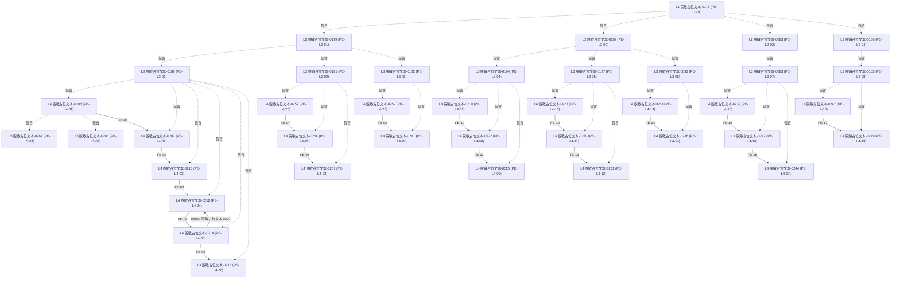

# 脱敏占位文本-0001 Policy Digest

> Digest：DIGEST-FIXTURE-POLICY-001-v1 · 状态：draft · 生成时间：2026-08-26T09:40:00+08:00 
> 本文件由 `digest.json` 确定性生成；业务确认状态以结构化数据为准。

## 文件身份表

| 字段 | 值 |
| --- | --- |
| 文档 ID | FIXTURE-POLICY-001 |
| 制度编号 | 脱敏占位文本-0071 |
| 版本 | v1 |
| 效力状态 | effective |
| 发布日 | 2025-01-01 |
| 生效日 | 2025-01-01 |
| 归口部门 | 脱敏占位文本-0073 |
| 批准主体 | 脱敏占位文本-0074 |
| 适用摘要 | 脱敏占位文本-0075 |
| 来源 | preamble · p.1 |

## 核心规则表

| 规则 ID | Disposition | Clause Type | 规范要求 | 参数 | 执行节点 | 来源 | 置信度 | 审核 |
| --- | --- | --- | --- | --- | --- | --- | --- | --- |
| R-01 | definition | definition | 脱敏占位文本-0113 | — | PE-L3-01；PE-L3-02 | ch1/s1 · p.2 | 0.9 | proposed |
| R-02 | mandatory | mandatory | 脱敏占位文本-0117 | quota=脱敏占位文本-0119 | PE-L3-01；PE-L3-02 | ch2/s1 · p.2 | 0.7 | proposed |
| R-03 | mandatory | mandatory | 脱敏占位文本-0125 | duration=脱敏占位文本-0126 | PE-L3-01；PE-L3-02 | ch2/s2 · p.3 | 0.7 | proposed |
| R-04 | procedural | procedural | 脱敏占位文本-0133 | — | PE-L4-01 | ch3/s1 · p.3 | 0.9 | proposed |
| R-05 | procedural | procedural | 脱敏占位文本-0138 | — | PE-L4-02；PE-L4-03；PE-L4-04；PE-L4-05 | ch3/s1/ct/sales · p.3 | 0.85 | proposed |
| R-06 | mandatory | mandatory | 脱敏占位文本-0146 | amount_threshold=脱敏占位文本-0148；amount_threshold=脱敏占位文本-0151 | PE-L4-05 | ch3/s1/note3 · p.4 | 0.8 | proposed |
| R-07 | mandatory | mandatory | 脱敏占位文本-0157 | — | PE-L5-02 | ch4/s1 · p.5 | 0.9 | proposed |
| R-08 | mandatory | mandatory | 脱敏占位文本-0161 | — | PE-L3-04；PE-L3-05；PE-L3-06 | ch3/s2/principle · p.4 | 0.9 | proposed |
| R-09 | definition | definition | 脱敏占位文本-0167 | cost_formula=脱敏占位文本-0168 | PE-L4-15；PE-L4-16；PE-L4-17 | ch7/s1 · p.7 | 0.85 | proposed |
| R-10 | penalty | penalty | 脱敏占位文本-0171 | violation_level=脱敏占位文本-0173 | PE-L4-18；PE-L4-19 | ch8/s2 · p.8 | 0.85 | proposed |

## 流程节点表

| 记录 ID | 层级/类别 | 类型 | 名称/关系 | 父级/流程 | 归属/条件 | 来源 | 审核 |
| --- | --- | --- | --- | --- | --- | --- | --- |
| PE-L1-01 | L1 | proc:ProcessCategory | 脱敏占位文本-0176 | — | — | preamble · p.1 | proposed |
| PE-L2-01 | L2 | proc:ProcessGroup | 脱敏占位文本-0179 | PE-L1-01 | — | ch3/s1 · p.3 | proposed |
| PE-L2-02 | L2 | proc:ProcessGroup | 脱敏占位文本-0182 | PE-L1-01 | — | ch3/s2 · p.4 | proposed |
| PE-L2-03 | L2 | proc:ProcessGroup | 脱敏占位文本-0093 | PE-L1-01 | — | ch7/s1 · p.7 | proposed |
| PE-L2-04 | L2 | proc:ProcessGroup | 脱敏占位文本-0186 | PE-L1-01 | — | ch8/s1 · p.8 | proposed |
| PE-L3-01 | L3 | proc:Process | 脱敏占位文本-0189 | PE-L2-01 | PE-L2-01 | ch3/s1/ct/sales · p.3 | proposed |
| PE-L3-02 | L3 | proc:Process | 脱敏占位文本-0191 | PE-L2-01 | PE-L2-01 | ch3/s1/ct/nrd · p.3 | proposed |
| PE-L3-03 | L3 | proc:Process | 脱敏占位文本-0192 | PE-L2-01 | PE-L2-01 | ch3/s1/ct/renew · p.4 | proposed |
| PE-L3-04 | L3 | proc:Process | 脱敏占位文本-0194 | PE-L2-02 | PE-L2-02 | ch3/s2/tosales · p.5 | proposed |
| PE-L3-05 | L3 | proc:Process | 脱敏占位文本-0197 | PE-L2-02 | PE-L2-02 | ch3/s2/toreturn · p.5 | proposed |
| PE-L3-06 | L3 | proc:Process | 脱敏占位文本-0092 | PE-L2-02 | PE-L2-02 | ch3/s2/cleanup · p.5 | proposed |
| PE-L3-07 | L3 | proc:Process | 脱敏占位文本-0093 | PE-L2-03 | PE-L2-03 | ch7/s1 · p.7 | proposed |
| PE-L3-08 | L3 | proc:Process | 脱敏占位文本-0102 | PE-L2-04 | PE-L2-04 | ch8/s2 · p.8 | proposed |
| PE-L4-01 | L4 | proc:ProcessActivity | 脱敏占位文本-0205 | PE-L3-01 | PE-L3-01 | ch3/s1 · p.3 | proposed |
| PE-L4-02 | L4 | proc:ProcessActivity | 脱敏占位文本-0207 | PE-L3-01 | PE-L3-01 | ch3/s1/ct/sales · p.3 | proposed |
| PE-L4-03 | L4 | proc:ProcessActivity | 脱敏占位文本-0210 | PE-L3-01 | PE-L3-01 | ch3/s1/ct/sales · p.3 | proposed |
| PE-L4-04 | L4 | proc:ProcessActivity | 脱敏占位文本-0212 | PE-L3-01 | PE-L3-01 | ch5/s1 · p.5 | proposed |
| PE-L4-05 | L4 | proc:ProcessActivity | 脱敏占位文本-0214 | PE-L3-01 | PE-L3-01 | ch3/s1/note3 · p.4 | proposed |
| PE-L4-06 | L4 | proc:ProcessActivity | 脱敏占位文本-0216 | PE-L3-01 | PE-L3-01 | ch3/s1/ct/sales · p.3 | proposed |
| PE-L4-07 | L4 | proc:ProcessActivity | 脱敏占位文本-0219 | PE-L3-04 | PE-L3-04 | ch3/s2/tosales · p.5 | proposed |
| PE-L4-08 | L4 | proc:ProcessActivity | 脱敏占位文本-0222 | PE-L3-04 | PE-L3-04 | ch3/s2/tosales · p.5 | proposed |
| PE-L4-09 | L4 | proc:ProcessActivity | 脱敏占位文本-0225 | PE-L3-04 | PE-L3-04 | ch3/s2/tosales · p.5 | proposed |
| PE-L4-10 | L4 | proc:ProcessActivity | 脱敏占位文本-0227 | PE-L3-05 | PE-L3-05 | ch3/s2/toreturn · p.5 | proposed |
| PE-L4-11 | L4 | proc:ProcessActivity | 脱敏占位文本-0230 | PE-L3-05 | PE-L3-05 | ch3/s2/toreturn · p.5 | proposed |
| PE-L4-12 | L4 | proc:ProcessActivity | 脱敏占位文本-0231 | PE-L3-05 | PE-L3-05 | ch3/s2/toreturn · p.5 | proposed |
| PE-L4-13 | L4 | proc:ProcessActivity | 脱敏占位文本-0233 | PE-L3-06 | PE-L3-06 | ch8/s1 · p.8 | proposed |
| PE-L4-14 | L4 | proc:ProcessActivity | 脱敏占位文本-0236 | PE-L3-06 | PE-L3-06 | ch3/s2/cleanup · p.5 | proposed |
| PE-L4-15 | L4 | proc:ProcessActivity | 脱敏占位文本-0239 | PE-L3-07 | PE-L3-07 | ch7/s1 · p.7 | proposed |
| PE-L4-16 | L4 | proc:ProcessActivity | 脱敏占位文本-0242 | PE-L3-07 | PE-L3-07 | ch7/s1 · p.7 | proposed |
| PE-L4-17 | L4 | proc:ProcessActivity | 脱敏占位文本-0244 | PE-L3-07 | PE-L3-07 | ch7/s3 · p.8 | proposed |
| PE-L4-18 | L4 | proc:ProcessActivity | 脱敏占位文本-0247 | PE-L3-08 | PE-L3-08 | ch8/s1 · p.8 | proposed |
| PE-L4-19 | L4 | proc:ProcessActivity | 脱敏占位文本-0249 | PE-L3-08 | PE-L3-08 | ch8/s2/level_table · p.9 | proposed |
| PE-L4-20 | L4 | proc:ProcessActivity | 脱敏占位文本-0252 | PE-L3-02 | PE-L3-02 | ch3/s1/ct/nrd · p.3 | proposed |
| PE-L4-21 | L4 | proc:ProcessActivity | 脱敏占位文本-0254 | PE-L3-02 | PE-L3-02 | ch3/s1/ct/nrd · p.3 | proposed |
| PE-L4-22 | L4 | proc:ProcessActivity | 脱敏占位文本-0257 | PE-L3-02 | PE-L3-02 | ch3/s1/ct/nrd · p.3 | proposed |
| PE-L4-23 | L4 | proc:ProcessActivity | 脱敏占位文本-0259 | PE-L3-03 | PE-L3-03 | ch4/s3 · p.5 | proposed |
| PE-L4-24 | L4 | proc:ProcessActivity | 脱敏占位文本-0261 | PE-L3-03 | PE-L3-03 | ch3/s1/ct/renew · p.4 | proposed |
| PE-L5-01 | L5 | proc:Task | 脱敏占位文本-0264 | PE-L4-01 | PE-L3-01 | ch3/s1 · p.3 | proposed |
| PE-L5-02 | L5 | proc:Task | 脱敏占位文本-0266 | PE-L4-01 | PE-L3-01 | ch4/s1 · p.5 | proposed |
| OBJ-01 | 目标 | proc:ProcessObjective | 脱敏占位文本-0269 | — | PE-L1-01 | preamble · p.1 | proposed |
| OBJ-02 | 目标 | proc:ProcessObjective | 脱敏占位文本-0270 | — | PE-L1-01 | preamble · p.1 | proposed |
| OBJ-03 | 目标 | proc:ProcessObjective | 脱敏占位文本-0271 | — | PE-L1-01 | preamble · p.1 | proposed |
| OBJ-04 | 目标 | proc:ProcessObjective | 脱敏占位文本-0272 | OBJ-01 | PE-L2-01 | ch2/s1 · p.2 | proposed |
| OBJ-05 | 目标 | proc:ProcessObjective | 脱敏占位文本-0273 | OBJ-01 | PE-L2-02 | ch3/s2 · p.4 | proposed |
| OBJ-06 | 目标 | proc:ProcessObjective | 脱敏占位文本-0274 | OBJ-03 | PE-L2-03 | ch7/s1 · p.7 | proposed |
| OBJ-07 | 目标 | proc:ProcessObjective | 脱敏占位文本-0275 | OBJ-01 | PE-L2-04 | ch8/s1 · p.8 | proposed |
| ART-01 | 产物 | document | 脱敏占位文本-0134 | PE-L5-01 | PE-L4-02；PE-L4-03；PE-L4-04；PE-L4-05；PE-L4-20；PE-L4-21 | ch3/s1 · p.3 | proposed |
| ART-02 | 产物 | document | 脱敏占位文本-0098 | PE-L5-02 | PE-L4-02 | ch4/s1 · p.5 | proposed |
| ART-03 | 产物 | system_record | 脱敏占位文本-0281 | PE-L4-06；PE-L4-22 | PE-L4-07；PE-L4-10；PE-L4-13；PE-L4-15；PE-L4-18；PE-L4-23 | ch3/s1/ct/sales · p.3 | proposed |
| ART-04 | 产物 | document | 脱敏占位文本-0286 | PE-L4-07 | PE-L4-08；PE-L4-09 | ch3/s2/tosales · p.5 | proposed |
| ART-05 | 产物 | document | 脱敏占位文本-0290 | PE-L4-11 | PE-L4-12 | ch3/s2/toreturn · p.5 | proposed |
| ART-06 | 产物 | document | 脱敏占位文本-0293 | PE-L4-23 | PE-L4-24 | ch4/s3 · p.5 | proposed |
| ART-07 | 产物 | document | 脱敏占位文本-0296 | PE-L4-14 | — | ch3/s2/scrap · p.5 | proposed |
| ART-08 | 产物 | data | 脱敏占位文本-0300 | PE-L4-17 | — | ch7/s1 · p.7 | proposed |
| ART-09 | 产物 | system_record | 脱敏占位文本-0305 | PE-L4-19 | — | ch8/s2 · p.8 | proposed |
| FE-01 | 流程边 | main | PE-L4-01 → PE-L4-02 | PE-L3-01 | — | ch3/s1/ct/sales · p.3 | proposed |
| FE-02 | 流程边 | main | PE-L4-02 → PE-L4-03 | PE-L3-01 | — | ch3/s1/ct/sales · p.3 | proposed |
| FE-03 | 流程边 | main | PE-L4-03 → PE-L4-04 | PE-L3-01 | — | ch3/s1/ct/sales · p.3 | proposed |
| FE-04 | 流程边 | main | PE-L4-04 → PE-L4-05 | PE-L3-01 | — | ch3/s1/ct/sales · p.3 | proposed |
| FE-05 | 流程边 | main | PE-L4-05 → PE-L4-06 | PE-L3-01 | 脱敏占位文本-0217 | ch3/s1/ct/sales · p.3 | proposed |
| FE-06 | 流程边 | reject | PE-L4-05 → PE-L4-04 | PE-L3-01 | 脱敏占位文本-0307 | ch3/s1/ct/sales · p.3 | proposed |
| FE-07 | 流程边 | main | PE-L4-20 → PE-L4-21 | PE-L3-02 | — | ch3/s1/ct/nrd · p.3 | proposed |
| FE-08 | 流程边 | main | PE-L4-21 → PE-L4-22 | PE-L3-02 | 脱敏占位文本-0258 | ch3/s1/ct/nrd · p.3 | proposed |
| FE-09 | 流程边 | main | PE-L4-23 → PE-L4-24 | PE-L3-03 | — | ch3/s1/ct/renew · p.4 | proposed |
| FE-10 | 流程边 | main | PE-L4-07 → PE-L4-08 | PE-L3-04 | — | ch3/s2/tosales · p.5 | proposed |
| FE-11 | 流程边 | main | PE-L4-08 → PE-L4-09 | PE-L3-04 | 脱敏占位文本-0224 | ch3/s2/tosales · p.5 | proposed |
| FE-12 | 流程边 | main | PE-L4-10 → PE-L4-11 | PE-L3-05 | 脱敏占位文本-0229 | ch3/s2/toreturn · p.5 | proposed |
| FE-13 | 流程边 | main | PE-L4-11 → PE-L4-12 | PE-L3-05 | 脱敏占位文本-0232 | ch3/s2/toreturn · p.5 | proposed |
| FE-14 | 流程边 | main | PE-L4-13 → PE-L4-14 | PE-L3-06 | 脱敏占位文本-0308 | ch3/s2/cleanup · p.5 | proposed |
| FE-15 | 流程边 | main | PE-L4-15 → PE-L4-16 | PE-L3-07 | — | ch7/s1 · p.7 | proposed |
| FE-16 | 流程边 | main | PE-L4-16 → PE-L4-17 | PE-L3-07 | — | ch7/s3 · p.8 | proposed |
| FE-17 | 流程边 | main | PE-L4-18 → PE-L4-19 | PE-L3-08 | 脱敏占位文本-0250 | ch8/s2 · p.8 | proposed |

## RACI 责任矩阵

| 分配 ID | 流程元素 | 角色 | RACI | 授权依据 | 来源 | 审核 |
| --- | --- | --- | --- | --- | --- | --- |
| RA-01 | PE-L3-01 | 脱敏占位文本-0112 | A | 脱敏占位文本-0309 | ch3/s1 · p.3 | proposed |
| RA-02 | PE-L3-02 | 脱敏占位文本-0112 | A | 脱敏占位文本-0310 | ch3/s1/ct/nrd · p.3 | proposed |
| RA-03 | PE-L3-03 | 脱敏占位文本-0112 | A | 脱敏占位文本-0311 | ch3/s1/ct/renew · p.4 | proposed |
| RA-04 | PE-L3-04 | 脱敏占位文本-0112 | A | 脱敏占位文本-0312 | ch3/s2/principle · p.4 | proposed |
| RA-05 | PE-L3-05 | 脱敏占位文本-0112 | A | 脱敏占位文本-0313 | ch3/s2/principle · p.4 | proposed |
| RA-06 | PE-L3-06 | 脱敏占位文本-0085 | A | 脱敏占位文本-0314 | ch3/s2/cleanup · p.5 | proposed |
| RA-07 | PE-L3-07 | 脱敏占位文本-0085 | A | 脱敏占位文本-0315 | ch7/s1 · p.7 | proposed |
| RA-08 | PE-L3-08 | 脱敏占位文本-0085 | A | 脱敏占位文本-0316 | ch8/s1 · p.8 | proposed |
| RA-09 | PE-L4-01 | 脱敏占位文本-0112 | R | 脱敏占位文本-0317 | ch3/s1 · p.3 | proposed |
| RA-10 | PE-L4-02 | 脱敏占位文本-0080 | R | 脱敏占位文本-0318 | ch3/s1/ct/sales · p.3 | proposed |
| RA-11 | PE-L4-03 | 脱敏占位文本-0081 | R | 脱敏占位文本-0318 | ch3/s1/ct/sales · p.3 | proposed |
| RA-12 | PE-L4-04 | 脱敏占位文本-0082 | R | 脱敏占位文本-0319 | ch5/s1 · p.5 | proposed |
| RA-13 | PE-L4-05 | 脱敏占位文本-0083 | R | 脱敏占位文本-0320 | ch3/s1/note3 · p.4 | proposed |
| RA-14 | PE-L4-06 | 脱敏占位文本-0087 | R | 脱敏占位文本-0321 | ch3/s1/ct/sales · p.3 | proposed |
| RA-15 | PE-L4-07 | 脱敏占位文本-0112 | R | 脱敏占位文本-0322 | ch3/s2/tosales · p.5 | proposed |
| RA-16 | PE-L4-08 | 脱敏占位文本-0086 | R | 脱敏占位文本-0323 | ch3/s2/tosales · p.5 | proposed |
| RA-17 | PE-L4-09 | 脱敏占位文本-0085 | R | 脱敏占位文本-0324 | ch3/s2/tosales · p.5 | proposed |
| RA-18 | PE-L4-10 | 脱敏占位文本-0087 | R | 脱敏占位文本-0325 | ch3/s2/toreturn · p.5 | proposed |
| RA-19 | PE-L4-11 | 脱敏占位文本-0112 | R | 脱敏占位文本-0326 | ch3/s2/toreturn · p.5 | proposed |
| RA-20 | PE-L4-12 | 脱敏占位文本-0085 | R | 脱敏占位文本-0327 | ch3/s2/toreturn · p.5 | proposed |
| RA-21 | PE-L4-13 | 脱敏占位文本-0085 | R | 脱敏占位文本-0328 | ch8/s1 · p.8 | proposed |
| RA-22 | PE-L4-14 | 脱敏占位文本-0085 | R | 脱敏占位文本-0329 | ch3/s2/cleanup · p.5 | proposed |
| RA-23 | PE-L4-15 | 脱敏占位文本-0085 | R | 脱敏占位文本-0330 | ch7/s1 · p.7 | proposed |
| RA-24 | PE-L4-16 | 脱敏占位文本-0085 | R | 脱敏占位文本-0330 | ch7/s1 · p.7 | proposed |
| RA-25 | PE-L4-17 | 脱敏占位文本-0085 | R | 脱敏占位文本-0331 | ch7/s3 · p.8 | proposed |
| RA-26 | PE-L4-18 | 脱敏占位文本-0085 | R | 脱敏占位文本-0328 | ch8/s1 · p.8 | proposed |
| RA-27 | PE-L4-19 | 脱敏占位文本-0085 | R | 脱敏占位文本-0332 | ch8/s2/level_table · p.9 | proposed |
| RA-28 | PE-L4-20 | 脱敏占位文本-0112 | R | 脱敏占位文本-0333 | ch3/s1/ct/nrd · p.3 | proposed |
| RA-29 | PE-L4-21 | 脱敏占位文本-0080 | R | 脱敏占位文本-0334 | ch3/s1/ct/nrd · p.3 | proposed |
| RA-30 | PE-L4-22 | 脱敏占位文本-0087 | R | 脱敏占位文本-0335 | ch3/s1/ct/nrd · p.3 | proposed |
| RA-31 | PE-L4-23 | 脱敏占位文本-0112 | R | 脱敏占位文本-0336 | ch4/s3 · p.5 | proposed |
| RA-32 | PE-L4-24 | 脱敏占位文本-0082 | R | 脱敏占位文本-0337 | ch3/s1/ct/renew · p.4 | proposed |
| RA-33 | PE-L5-01 | 脱敏占位文本-0112 | R | 脱敏占位文本-0338 | ch3/s1 · p.3 | proposed |
| RA-34 | PE-L5-02 | 脱敏占位文本-0112 | R | 脱敏占位文本-0339 | ch4/s1 · p.5 | proposed |

## 风险控制矩阵

| 记录 ID | 类别 | 描述/措施 | 关联风险/规则 | 关联流程 | 依据 | 来源 | 审核 |
| --- | --- | --- | --- | --- | --- | --- | --- |
| RISK-01 | 风险 | 脱敏占位文本-0340 | R-03；R-08 | PE-L3-06 | analysis | ch3/s2/cleanup · p.5 | proposed |
| RISK-02 | 风险 | 脱敏占位文本-0342 | R-02；R-03 | PE-L3-01；PE-L3-02 | analysis | ch2/s1 · p.2 | proposed |
| RISK-03 | 风险 | 脱敏占位文本-0344 | R-09 | PE-L3-07 | analysis | ch7/s1 · p.7 | proposed |
| RISK-04 | 风险 | 脱敏占位文本-0346 | R-08；R-10 | PE-L3-08 | analysis | ch5/s2 · p.6 | proposed |
| RISK-05 | 风险 | 脱敏占位文本-0348 | R-06 | PE-L4-05 | analysis | ch3/s1/note3 · p.4 | proposed |
| CTRL-01 | 控制 | 脱敏占位文本-0350 | RISK-02 | PE-L3-01 | explicit_text | ch3/s1/ct/sales · p.3 | proposed |
| CTRL-02 | 控制 | 脱敏占位文本-0357 | RISK-05 | PE-L4-05 | explicit_text | ch3/s1/note3 · p.4 | proposed |
| CTRL-03 | 控制 | 脱敏占位文本-0360 | RISK-01 | PE-L3-06 | explicit_text | ch8/s1 · p.8 | proposed |
| CTRL-04 | 控制 | 脱敏占位文本-0367 | RISK-03 | PE-L3-07 | explicit_text | ch7/s3 · p.8 | proposed |
| CTRL-05 | 控制 | 脱敏占位文本-0373 | RISK-04 | PE-L3-08 | explicit_text | ch8/s2/level_table · p.9 | proposed |

## 制度问题及优化建议清单

| 记录 ID | 类别 | 问题/待确认 | 影响 | 建议/负责人 | 阻断 | 来源 |
| --- | --- | --- | --- | --- | --- | --- |
| ISSUE-01 | 脱敏占位文本-0376 | 脱敏占位文本-0377 | 脱敏占位文本-0378 | 脱敏占位文本-0379 | 否 | ch2/s1 · p.2 |
| ISSUE-02 | 脱敏占位文本-0376 | 脱敏占位文本-0380 | 脱敏占位文本-0381 | 脱敏占位文本-0382 | 否 | ch2/s2 · p.3 |
| ISSUE-03 | 脱敏占位文本-0383 | 脱敏占位文本-0384 | 脱敏占位文本-0385 | 脱敏占位文本-0386 | 否 | ch3/s1/note3 · p.4 |
| ISSUE-04 | 脱敏占位文本-0387 | 脱敏占位文本-0070 | 脱敏占位文本-0388 | 脱敏占位文本-0389 | 否 | ch6/s2 · p.6 |
| PC-01 | 待确认 | 脱敏占位文本-0390 | 脱敏占位文本-0391 | 脱敏占位文本-0073 | 否 | ch2/s1 · p.2 |
| PC-02 | 待确认 | 脱敏占位文本-0392 | 脱敏占位文本-0393 | 脱敏占位文本-0073 | 否 | ch2/s2 · p.3 |
| PC-03 | 待确认 | 脱敏占位文本-0394 | 脱敏占位文本-0395 | 脱敏占位文本-0073 | 否 | ch3/s1/note3 · p.4 |
| PC-04 | 待确认 | 脱敏占位文本-0396 | 脱敏占位文本-0397 | 脱敏占位文本-0073 | 否 | ch6/s2 · p.6 |

## 端到端流程图

