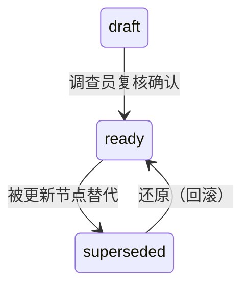

# nodes/ 目录 — 分析推理层

`nodes/` 目录承载证据链的推理分析层。与 `evidence_registry.json` 通过 ID 空间关联，关系声明仅存在于各节点文件的 frontmatter 中，不在 JSON 中维护副本。

## 目录规则

```
cases/CASE-NNNN/
├── nodes/                     ← 所有节点扁平存放，不按类型分子目录
│   ├── EV-001.json            ← 结构化数据用 JSON
│   ├── LS-001.md              ← 叙事型分析用 markdown
│   ├── ARG-001.md
│   ├── FND-001.md
│   ├── ENT-001.json
│   ├── HYP-001.json
│   └── EVT-001.json
├── evidence_registry.json     ← 索引（chain_nodes）+ 结构化摘要
└── raw/                       ← 原始文件（PDF、截图），图外
```

**关键规则**：

| 规则 | 含义 |
|------|------|
| 类型在 frontmatter | 不按节点类型分子目录——线索可能升格为论据，搬文件会断引用 |
| 关系在节点内 | relations（derived_from/supports/contradicts 等）仅在节点文件的 frontmatter 中声明，不另造边文件 |
| JSON 只做索引 | evidence_registry.json 的 chain_nodes 仅记录 ID、type、status，不做关系副本 |
| ID 不可变 | EV-ID 一旦注册永不改变。派生证据用新 EV-ID，`supersedes` 字段标注来源 |

## 节点类型总览

| 前缀 | 类型 | 文件格式 | 存储位置 | 生命周期 |
|------|------|----------|----------|---------|
| `EV-` | evidence | JSON（结构化） | `nodes/EV-NNN.json` | 注册→冻结 |
| `LS-` | clue | MD（叙事型） | `nodes/LS-NNN.md` | draft→ready→superseded |
| `ARG-` | argument | MD（叙事型） | `nodes/ARG-NNN.md` | draft→ready→superseded |
| `FND-` | finding | MD（叙事型） | `nodes/FND-NNN.md` | draft→ready→superseded |
| `ENT-` | entity | JSON（结构化） | `nodes/ENT-NNN.json` | 注册→冻结 |
| `HYP-` | hypothesis | JSON（结构化） | `nodes/HYP-NNN.json` | active→rejected/confirmed |
| `EVT-` | event | JSON（结构化） | `nodes/EVT-NNN.json` | 追加→冻结 |

## 状态机



**关键规则**：
- AI 可以创建和编辑 `draft` 节点
- `draft → ready` **仅限调查员操作**（AI 不能批准自己生成的内容）
- `finding` 节点仅当 derived_from 链中所有节点均为 `ready` 时才能转为 `ready`
- `superseded` 节点保留文件，添加 `supersedes` 字段指向替代节点，不删除

## 关系声明

所有关系通过各节点文件 frontmatter 中的 `relations` 命名空间字段声明。每条关系按语义类型分组，不再使用通用 `sources` 字段。

```yaml
# nodes/LS-001.md —— 完整示例
relations:
  derived_from:
    - id: EV-001
      excerpt: "设备在广州激活"
      form: data
    - id: EV-004
      excerpt: "激活日志第12-18行"
      form: data
  supports:
    - ARG-001
  contradicts: []
  involves:
    - ENT-001
```

**8 种关系类型**（含 HYP 专用的 2 种被动型）：

| 关系类型 | 语义 | 方向 | 值格式 | 适用节点 |
|---------|------|------|--------|------|
| `derived_from` | 推导自/来源于 | 本 → 上游 | 推荐详尽格式（id+excerpt+form） | EV, LS, ARG, FND, EVT |
| `supports` | 支撑/支持结论 | 本 → 下游 | 简洁格式（ID 列表） | LS, ARG, EVT |
| `contradicts` | 反驳/矛盾 | 本 → 目标 | 简洁格式 | EV, LS, ARG, FND, HYP |
| `involves` | 涉及实体 | 本 → ENT | 简洁格式 | EV, LS, ARG, FND, EVT, ENT |
| `corroborated_by` | 被印证 | 本 → EV | 简洁格式 | EV（仅） |
| `addresses` | 应对竞争假设 | 本 → HYP | 简洁格式 | HYP（仅） |
| `supported_by` | 被支持（被动） | 上游 → 本 | 简洁格式（ID 列表） | HYP（仅） |
| `contradicted_by` | 被反驳（被动） | 上游 → 本 | 简洁格式（ID 列表） | HYP（仅） |

**值格式**：

```yaml
# 简洁格式（仅 ID 列表）——用于 suppports/contradicts/involves
supports: ["ARG-001", "ARG-002"]

# 详细格式（含 excerpt 引用）——用于 derived_from
derived_from:
  - id: EV-001
    excerpt: "设备在广州激活"
    form: data
```

**规则**：
- 关系只向下声明：每个节点声明自己的上游依赖，不维护"谁引用了我"的字段
- 反向追溯由 `scan-chain.py` 自动计算
- FND 的 `derived_from` 应为 ARG 节点，而非直接引用 EV 节点（`scan-chain.py --check-chains` 会检查此项）
- 矛盾关系通过 HYP 的 `contradicted_by` 或 LS/ARG 的 `contradicts` 字段显式处理
- `supports` 和 `contradicts` 不应指向同一个目标（`scan-chain.py --check-chains` 会警告冲突）

## 节点内容生成规范

节点文件（EV/LS/ARG/FND）的标题和正文遵循统一的撰写规则，确保在树状图、力导向图等可视化工具中"一眼看清"证据链的因果和逻辑关系。

### title 断言公式

title 即断言。每条 title 必须是一个可直接读出的判断，不含描述过程词和元信息前缀。

| 类型 | 断言公式 | 说明 | 好示例 | 差示例 |
|------|---------|------|--------|--------|
| EV | `谁 + 动作 + 事实` | 主体行为+核心事实，整句 | `王赞供述: 扩容虚构` | `王赞承认项目名称扩容是虚构的正常名称应是奥飞200G网卡采购` |
| LS | `断言事实` | 直接陈述事实本身 | `项目名称纯属虚构` | `项目名称虚构确认`（"确认"是动作） |
| ARG | `可推断: 局部结论` | 推理结论，不写论证过程 | `已构成假单申报` | `项目虚构的逻辑论证`（"逻辑论证"是元信息） |
| FND | `行为 + 违规类型` | 可直接写入报告的事实认定 | `虚假项目申报假单` | `王赞虚构项目名称申报假单`（含主体，treemap 框内显示不全） |
| HYP | `可能: 假设陈述` | 以可能性开头的假设 | `举报存不实动机` | `HYP-001`（无信息量） |
| EVT | `时间 + 事件` | 事件标识 | `5月第三轮访谈` | `EVT-003`（无信息量） |
| ENT | `角色: 名称` | 实体标识 | `经办人: 邓富星` | `ENT-002`（无信息量） |

**原则**：
- title 不含"结论："、"证据："、"论证："等元信息前缀——类型已由 `FND-` `EV-` `ARG-` 等前缀写明
- title 不含论证过程、不含上下文背景
- EV 类型如需在 treemap 上承载一句完整陈述，使用 `summary` 字段补充（已有字段）

### body 写作规范

每类节点的正文由一组强制章节构成。每个章节有明确的写作意图，不得省略、合并或替换。

| 类型 | 强制章节 | 各章节意图 |
|------|---------|-----------|
| EV | `关键内容摘要` | 证据中提取的事实片段——让读者直接看到证据说什么 |
| | `使用说明` | 证据的限制、可信度、关联线索——让读者知道怎么用这份证据 |
| LS | `关键发现` | 从原始证据中提炼的核心事实——表格优先，每条发现标注来源 EV-ID |
| | `下一步` | 还需要什么补充证据或分析——让调查方向和缺口可见 |
| ARG | `推理前提` | 从 LS 到结论的推演步骤——分前提列出，每步标注引用 |
| | `剩余怀疑` | 尚未排除的替代解释或不确定性——不可省略；写"无"也保留章节 |
| FND | `推理路径` | 图示化呈现从 EV 到 FND 的完整链路——标识每条支撑线的走向 |
| | `推理依据` | 最终认定的逻辑推导——从支撑论据到结论的完整说理 |
| | `剩余怀疑` | 仍然存在的不确定性——关乎结论可被攻击的弱点 |
| ENT | 正文非必须 | 结构化数据在 frontmatter 中表达即可 |
| HYP | 正文非必须 | 同上 |
| EVT | 正文非必须 | 同上 |

**title 与 body 的衔接**：

> title 是断言，body 是支持该断言的完整材料。
> body 的第一章必须与 title 呼应——让读者读完第一章（约 3-5 行）就知道 title 的结论从何而来。

每份 body 的三个自检标准：

1. **完整性**：拟审理人员读完 body 后，能否不依赖其他材料理解该节点的全部信息？→ 不能则遗漏
2. **精炼性**：去掉任意一段是否无损于读者理解？→ 能则那段是废话
3. **可追溯性**：body 中每个 claim 是否标注了来源 ID？→ 否则补充引用

### excerpt 撰写规则

excerpt 是"流向下一级的事实"——告诉下游节点/读者这段关系承载的具体内容。

**原则**：
- excerpt 是流向事实，不是文件元信息
  - ✅ `承认扩容虚构`（从 EV-001 流向 LS-001 的关键事实）
  - ❌ `王赞第三轮访谈笔录`（那是来源属性，不是流向事实）
- excerpt 应为一个可独立阅读的短语，不超过 25 字
- 跨类型推理（LS→ARG），excerpt 可写"因 A+B → C"式组合
- 当前 `relations.derived_from` 已支持 `id` / `excerpt` / `form` 三个子字段

## 创建节奏

| 阶段 | 节点操作 |
|------|---------|
| **INIT** | 在 evidence_registry.json 注册 EV-001（举报线索），创建初始 ENT/HYP 节点 |
| **PRE_INVESTIGATION** | 追加 EV 节点，创建 LS 节点做线索分析 |
| **FIELDWORK** | 大量追加 EV（访谈/调证），创建 ARG 节点构建论据 |
| **REVIEWING** | 创建 FND 节点做事实认定，冻结所有节点 |

## 使用示例

```bash
# 创建线索节点
> id: LS-003 | type: clue | status: draft | title: "跨区激活异常" | relations: {derived_from: [EV-001, EV-004], supports: [ARG-001]}

# 升格为论据（不改文件路径，只改 frontmatter）
> id: ARG-001 | type: argument | status: draft | proposition: "激活记录证明跨区销售" | relations: {derived_from: [LS-001, LS-003], supports: [FND-001]}

# 记录结论
> id: FND-001 | type: finding | status: draft | confidence: probable | relations: {derived_from: [ARG-001]}
```

## 模板参考

各节点类型的 frontmatter 模板位于 `project-templates/default/nodes/`：
- `EV-NNN.md` — 证据节点模板
- `LS-NNN.md` — 线索节点模板
- `ARG-NNN.md` — 论据节点模板
- `FND-NNN.md` — 事实认定模板
- `ENT-NNN.md` — 实体模板
- `HYP-NNN.md` — 假设模板
- `EVT-NNN.md` — 事件模板
